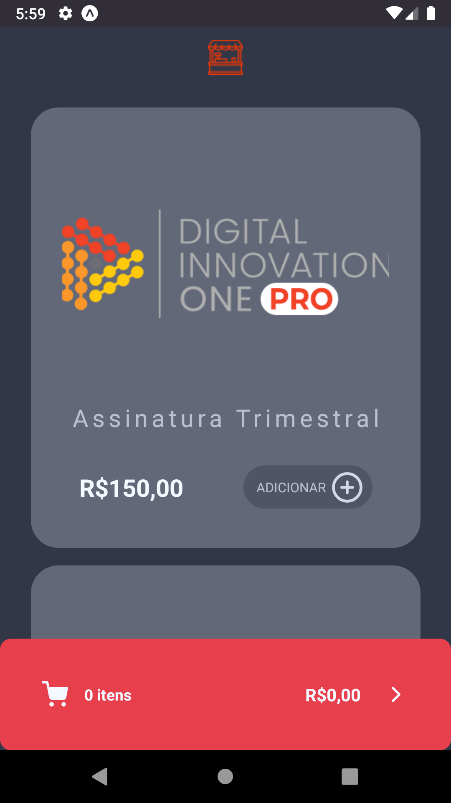
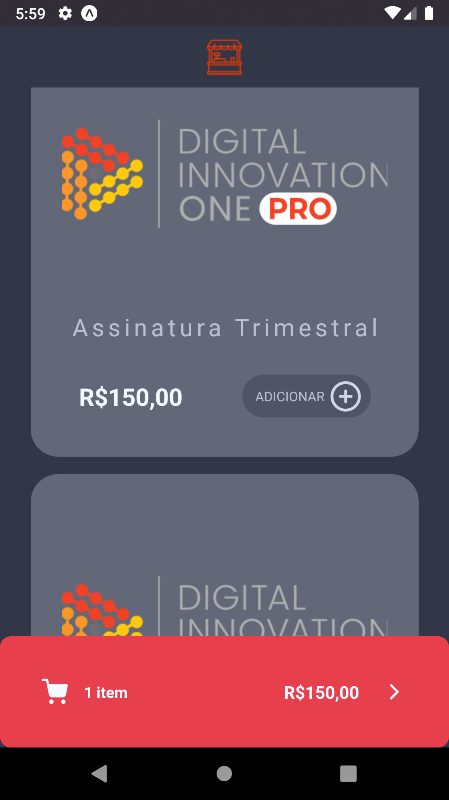
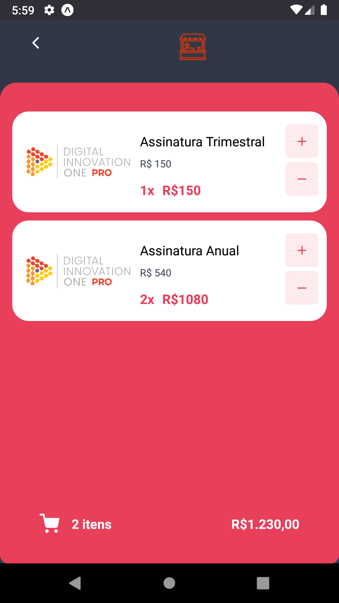

# Projeto desenvolvido com expo 🖥📳
### Gerenciar estados da aplicação é fundamental para um bom funcionamento
> O projeto que simula um carrinho de e-commerce com a utilização do redux

  
  
  

# Instalação
* No seu terminal utilize o comando: `git clone https://github.com/Ralisson-Mattias/redux`
* Após copiar o projeto para a sua maquina, utilize os comandos `expo install` ou `yarn install` para instalar as dependências necessárias

# Rodando o app
* Inicie o json-server com o comando `yarn json-server db.json -w`
  * Note que o `api.js` está configurado para rodar no endereço `http://10.0.2.2:3000`, essa configuração é usada para rodar em emuladores android, para um emulador
    ios, use o comando `http://localhost:3000` ao invés de `http://10.0.2.2:3000`
* Inicie o projeto normalmente de acordo com sua necessidade

### Links
* https://lottiefiles.com/
* https://expo.io/
* https://redux.js.org/
* https://github.com/typicode/json-server

### Bônus -> Utilização do lottie para animações
